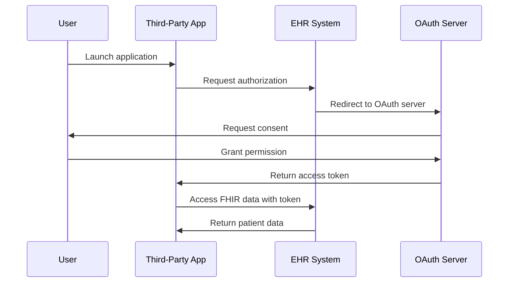

# SMART on FHIR: Comprehensive Overview

## Executive Summary

**SMART on FHIR** (Substitutable Medical Applications, Reusable Technologies on Fast Healthcare Interoperability Resources) is an open standard that enables third-party applications to securely integrate with Electronic Health Record (EHR) systems. It combines FHIR data standards with OAuth 2.0 authentication to create a "write once, run anywhere" ecosystem for medical applications.

---

## What is FHIR?

**Fast Healthcare Interoperability Resources (FHIR)** is a modern healthcare data standard developed by Health Level Seven International (HL7).

### Key Characteristics:
- **Modern Web Standards**: Uses RESTful APIs, JSON, XML, and HTTP
- **Modular Framework**: Defines standardized resources (Patient, Observation, Medication, etc.)
- **Improved Interoperability**: Makes healthcare data more accessible across diverse systems
- **Reduced Complexity**: Simpler to implement than previous HL7 standards (v2, v3, CDA)

### FHIR Resources:
- Patient demographics
- Clinical observations
- Medications and allergies
- Diagnostic reports
- Procedures and encounters
- Care plans and goals

---

## What is SMART on FHIR?

SMART on FHIR is a framework that builds upon FHIR to enable secure, standards-based integration of applications with EHR systems.

### Core Components:

1. **FHIR Data Standard**: Provides structured healthcare data exchange
2. **OAuth 2.0 Authentication**: Manages secure authorization and access control
3. **OpenID Connect**: Validates user identity
4. **Launch Context**: Enables apps to launch from within EHR systems

### How It Works:

### Launch Modes:

1. **EHR Launch**: App launches from within the EHR interface
2. **Standalone Launch**: App launches independently and connects to EHR
3. **Backend Services**: System-to-system communication without user interaction

### OAuth 2.0 Flows:

- **Authorization Code Flow**: For web and mobile apps requiring user authentication
- **Client Credentials Flow**: For system-to-system interactions
- **PKCE (Proof Key for Code Exchange)**: Enhanced security for mobile/browser apps

---

## Benefits of SMART on FHIR

### For Healthcare Providers:
- Access to innovative third-party applications
- Improved workflow integration
- Reduced vendor lock-in
- Enhanced care coordination

### For Developers:
- Single API to access multiple EHR systems
- Standard authentication mechanisms
- Reduced development complexity
- Larger potential market

### For Patients:
- Better access to personal health data
- Choice of health apps and services
- Improved care coordination
- Greater control over data sharing

### For Healthcare Systems:
- Regulatory compliance (21st Century Cures Act)
- Improved interoperability
- Innovation ecosystem
- Cost reduction through standardization

---

## Technical Architecture

### SMART Scopes:

Scopes control what data an application can access:

- `patient/*.read`: Read all patient data
- `patient/Observation.read`: Read observations only
- `patient/MedicationRequest.read`: Read medication orders
- `user/*.read`: Access data in user's context
- `launch`: Receive launch context
- `openid`, `profile`: User identity information

### Token Management:

- **Access Tokens**: Short-lived tokens (typically 1 hour) for API access
- **Refresh Tokens**: Long-lived tokens to obtain new access tokens
- **Token Expiration**: Automatic expiration for security
- **Token Revocation**: Ability to revoke access at any time

---

## Regulatory Context

### 21st Century Cures Act:
- Mandates patient access to health data
- Prohibits information blocking
- Requires open APIs for EHR systems
- Drives SMART on FHIR adoption

### HIPAA Requirements:
- Protected Health Information (PHI) security
- Access control and audit logging
- Business Associate Agreements (BAAs)
- Patient consent management

### GDPR Considerations:
- Data protection for international patients
- Right to data portability
- Explicit consent requirements
- Data breach notification

---

## Current Adoption

### Healthcare Organizations:
- Major EHR vendors (Epic, Cerner, Allscripts) support SMART on FHIR
- Growing app ecosystem (patient portals, clinical decision support, research tools)
- Increasing regulatory pressure for adoption

### Challenges:
- Varying levels of implementation completeness
- Inconsistent FHIR resource support across vendors
- Security concerns with third-party apps
- Cost and complexity of implementation

---

## Research References

1. **HL7 FHIR Specification**: [https://www.hl7.org/fhir/](https://www.hl7.org/fhir/)
2. **SMART Health IT**: [https://smarthealthit.org/](https://smarthealthit.org/)
3. Mandl, K. D., & Kohane, I. S. (2016). "A 21st-Century Health IT System — Creating a Real-World Information Economy." *New England Journal of Medicine*.
4. Alterovitz, G., et al. (2015). "SMART on FHIR: A Standards-Based, Interoperable Apps Platform for Electronic Health Records." *Journal of the American Medical Informatics Association*.
5. Kawamoto, K., et al. (2019). "Improving Clinical Practice Using Clinical Decision Support Systems: A Systematic Review of Trials to Identify Features Critical to Success." *BMJ*.

---

## Next Steps

This document provides the foundation for understanding SMART on FHIR. Additional documents in this series cover:

- **Privacy Concerns** → See `2_Privacy_Security_Issues.md`
- **Security Vulnerabilities** → See `2_Privacy_Security_Issues.md`
- **Data Integrity Challenges** → See `3_Data_Integrity_Issues.md`
- **Problem Analysis** → See `4_Problem_Analysis.md`
- **Solution Framework** → See `5_Solution_Framework.md`
