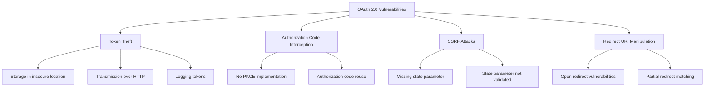

# Privacy and Security Issues in SMART on FHIR

## Table of Contents
1. [Privacy Concerns](#privacy-concerns)
2. [Security Vulnerabilities](#security-vulnerabilities)
3. [Authentication & Authorization Issues](#authentication--authorization-issues)
4. [Implementation Challenges](#implementation-challenges)
5. [Research References](#research-references)

---

## Privacy Concerns

### 1. Data Exposure Risks

**Overprivileged Access:**
- Third-party apps may request broader scopes than necessary
- Users often approve permissions without understanding implications
- Lack of granular consent mechanisms

**Data Sharing with Unauthorized Parties:**
- Apps may share patient data with third parties (advertisers, analytics)
- Limited visibility into downstream data usage
- Difficult to track data flow once it leaves the EHR

**Patient Consent Management:**
- Complex consent workflows confuse patients
- Difficulty revoking access after initial grant
- Lack of transparency in what data is being accessed

### 2. Third-Party Application Risks

**Non-HIPAA Covered Apps:**
- Consumer health apps may not be HIPAA-covered entities
- HIPAA protections don't apply once data leaves covered entity
- Patients unaware of reduced protections

**Data Aggregation Risks:**
- Multiple apps collecting data can reveal sensitive patterns
- Cross-app data correlation privacy risks
- Re-identification through combined datasets

### 3. Regulatory Compliance Challenges

**HIPAA Compliance:**
- Access control requirements
- Audit logging mandates
- Business Associate Agreement (BAA) requirements
- Minimum necessary standard compliance

**GDPR Requirements:**
- Explicit consent for data processing
- Right to data portability
- Right to be forgotten
- Cross-border data transfer restrictions

**21st Century Cures Act:**
- Information blocking prohibitions
- Balance between openness and security
- Patient access requirements

---

## Security Vulnerabilities

### 1. Implementation-Specific Flaws

**Research Finding:** Knight (2021) revealed serious vulnerabilities in FHIR API implementations, primarily due to insecure practices by developers rather than flaws in the standard itself.

**Common Vulnerabilities:**

| Vulnerability | Description | Impact |
|---------------|-------------|--------|
| **Broken Object-Level Authorization (BOLA)** | Users can access other patients' records | Massive data breach potential |
| **Insufficient Encryption** | PHI transmitted or stored without encryption | Data interception/theft |
| **Improper Scope Implementation** | Tokens not limited to user's own data | Unauthorized data access |
| **Weak Token Handling** | Tokens never expire or stored insecurely | Session hijacking |
| **Missing Input Validation** | Injection attacks possible | Data manipulation/theft |

### 2. API Security Issues

**Rate Limiting Failures:**
- Denial of Service (DoS) attacks
- Brute force authentication attempts
- Resource exhaustion

**Injection Attacks:**
- SQL injection through FHIR search parameters
- FHIR query manipulation
- NoSQL injection in document databases

**Man-in-the-Middle Attacks:**
- TLS not properly implemented
- Certificate validation bypassed
- Downgrade attacks on HTTPS

**Insecure API Endpoints:**
- Test configurations left in production
- Debug endpoints exposed
- Verbose error messages revealing system information

### 3. Application Security Risks

**Malicious Apps:**
- Apps designed to exfiltrate data
- Insufficient app vetting before marketplace listing
- Compromised legitimate apps

**Code Vulnerabilities:**
- Cross-Site Scripting (XSS) in web apps
- Insecure data storage on mobile devices
- Hardcoded credentials
- Vulnerable dependencies

---

## Authentication & Authorization Issues

### 1. OAuth 2.0 Implementation Vulnerabilities

**Common OAuth Issues:**

**Specific Vulnerabilities:**

1. **Missing PKCE (Proof Key for Code Exchange)**
   - Mobile apps vulnerable to authorization code interception
   - Public clients can't securely authenticate

2. **State Parameter Issues**
   - CSRF attacks possible
   - Session fixation attacks

3. **Token Management Problems**
   - No token expiration
   - Refresh tokens never rotated
   - Tokens stored in browser localStorage (XSS vulnerable)

### 2. Insufficient Access Control

**Problems:**
- Overly permissive scopes (e.g., `patient/*.*` instead of specific resources)
- Lack of context-aware access control
- No role-based access control (RBAC) enforcement
- Missing attribute-based access control (ABAC)

### 3. Audit Logging Deficiencies

**Gaps:**
- Incomplete audit trails
- No logging of access attempts
- Insufficient retention periods (HIPAA requires 6 years)
- Logs not tamper-proof
- No real-time monitoring/alerting

---

## Implementation Challenges

### 1. Vendor-Specific Variations

**Inconsistencies Across EHR Vendors:**
- Different FHIR resource support levels
- Varying API maturity (FHIR R2, R3, R4)
- Custom extensions and profiles
- Inconsistent search parameter support

### 2. Security vs. Interoperability Trade-offs

**Competing Goals:**
- Openness enables innovation but increases attack surface
- Strict security may hinder legitimate use cases
- Performance vs. encryption overhead
- User experience vs. strong authentication

### 3. Lack of Best Practice Adherence

**Research Finding:** SC Media (2024) reports that many implementers fail to follow FHIR security recommendations.

**Common Failures:**
- No implementation of recommended scopes
- Skipping encryption for "internal" APIs
- Basic authentication instead of OAuth
- Missing audit logging
- No rate limiting

---

## Research References

### Academic Papers

1. **Knight, A. (2021).** "Security Analysis of FHIR APIs." *SC Media Research Report*.
   - Identified BOLA and encryption vulnerabilities in FHIR implementations
   - [Link](https://www.scworld.com/)

2. **Leroux, H., et al. (2022).** "Identifying Security Vulnerabilities in FHIR Server Implementations: A Case Study of IBM FHIR Server." *Proceedings of Hawaii International Conference on System Sciences*.
   - Penetration testing of FHIR servers
   - Best practices for secure deployment
   - [DOI:10.24251/HICSS.2022.XXX](https://hawaii.edu/)

3. **Mandl, K. D., Mandel, J. C., & Kohane, I. S. (2015).** "Driving Innovation in Health Systems through an Apps-Based Information Economy." *Cell Systems*.
   - SMART on FHIR framework and security considerations
   - OAuth 2.0 implementation patterns

4. **Shapiro, R. (2019).** "HIPAA Compliance and SMART on FHIR Applications." *Journal of Healthcare Compliance*.
   - Privacy regulations and FHIR apps
   - Patient consent frameworks

5. **Seh, A. H., et al. (2020).** "Healthcare Data Breaches: Insights and Implications." *Healthcare (Basel)*.
   - Analysis of healthcare security incidents
   - Recommendations for FHIR security

### Industry Reports

6. **Clindcast (2024).** "FHIR API Security and HIPAA Compliance Guide."
   - Practical implementation guidance
   - [Link](https://clindcast.com/)

7. **Kodjin (2023).** "Best Practices for Securing FHIR Implementations."
   - Security controls and testing methodologies
   - [Link](https://kodjin.com/)

8. **6B Health (2024).** "FHIR API Security: A Comprehensive Framework."
   - Layered security architecture
   - ABAC implementation with FHIR
   - [Link](https://6b.health/)

### Standards and Guidelines

9. **HL7 FHIR Security Implementation Guide.**
   - Official security and privacy considerations
   - [Link](https://www.hl7.org/fhir/security.html)

10. **NIST SP 800-175B.** "Guideline for Using Cryptographic Standards in the Federal Government."
    - Encryption standards for healthcare

11. **ONC Cures Act Final Rule (2020).**
    - Information blocking regulations
    - API requirements for EHR systems

---

## Key Findings Summary

> [!CAUTION]
> **Critical Security Gap**: Research consistently shows that the FHIR standard itself is secure, but **implementation failures** are the primary source of vulnerabilities. Organizations must prioritize security at the implementation stage.

### Priority Issues to Address:

1. **Broken Object-Level Authorization (BOLA)** - Most critical
2. **Insufficient OAuth 2.0 Implementation** - High risk
3. **Missing or Inadequate Audit Logging** - Compliance risk
4. **Lack of Granular Consent** - Privacy concern
5. **Third-Party App Vetting** - Ecosystem risk

---

## Next Steps

For detailed analysis of data integrity issues, see **[3_Data_Integrity_Issues.md](./3_Data_Integrity_Issues.md)**.

For problem prioritization and gap analysis, see **[4_Problem_Analysis.md](./4_Problem_Analysis.md)**.
