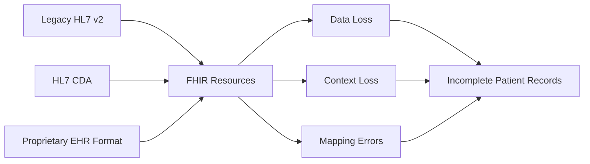
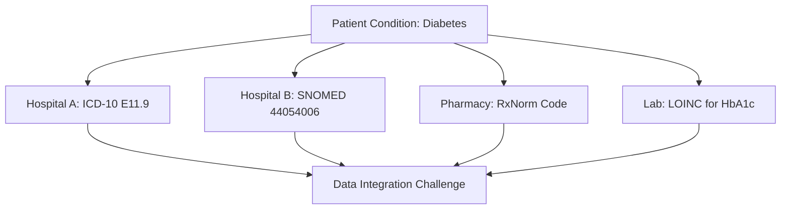
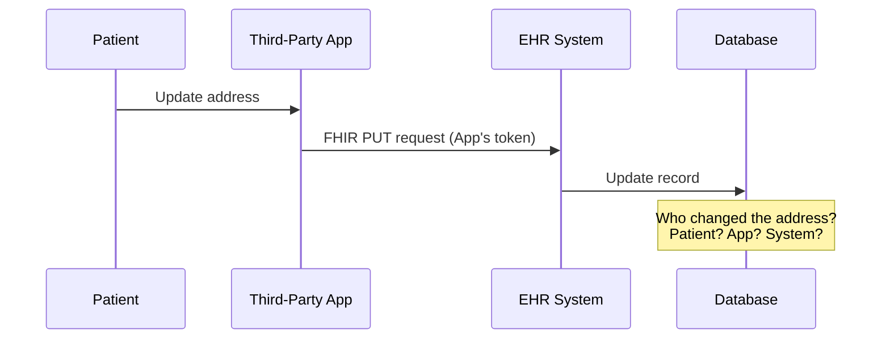

# Data Integrity Issues in FHIR and EHR Interoperability

## Table of Contents
1. [Understanding Data Integrity in Healthcare](#understanding-data-integrity-in-healthcare)
2. [FHIR-Specific Integrity Challenges](#fhir-specific-integrity-challenges)
3. [Data Quality Issues](#data-quality-issues)
4. [Data Modification Risks](#data-modification-risks)
5. [Audit and Accountability](#audit-and-accountability)
6. [Research References](#research-references)

---

## Understanding Data Integrity in Healthcare

### Definition

**Data Integrity** ensures that healthcare data is:
- **Accurate**: Reflects true patient information
- **Complete**: No missing critical information
- **Consistent**: Same data across different systems
- **Timely**: Current and up-to-date
- **Valid**: Conforms to defined formats and rules

### Importance in Healthcare

| Aspect | Impact of Poor Data Integrity |
|--------|------------------------------|
| **Patient Safety** | Incorrect treatment decisions, medication errors, missed diagnoses |
| **Clinical Outcomes** | Reduced effectiveness of care plans, poor care coordination |
| **Regulatory Compliance** | HIPAA violations, legal liability |
| **Financial** | Billing errors, denied claims, audit findings |
| **Research** | Invalid study results, flawed clinical trials |

---

## FHIR-Specific Integrity Challenges

### 1. Data Transformation Issues

**Problem:** Converting data between different formats can introduce errors.

**FHIR Transformation Challenges:**



**Common Transformation Errors:**
- **Unmapped Fields**: Legacy data elements with no FHIR equivalent
- **Semantic Loss**: Context or meaning lost in translation
- **Precision Loss**: Date/time or numeric precision reduced
- **Code System Mismatches**: Different terminology systems (SNOMED, LOINC, ICD-10)

### 2. Version Compatibility Issues

**FHIR Versions:**
- DSTU2 (Draft Standard for Trial Use 2)
- STU3 (Standard for Trial Use 3)
- R4 (Release 4)
- R5 (Release 5) - Current

**Problems:**
- Breaking changes between versions
- Resources restructured (e.g., MedicationRequest in R4 vs. MedicationOrder in DSTU2)
- Apps built for one version may not work with another
- Data migration challenges

### 3. Incomplete Data Representations

**Research Finding:** Studies show that FHIR resources may not capture all clinical context, leading to information loss during exchange.

**Examples:**

| Clinical Scenario | FHIR Limitation |
|-------------------|-----------------|
| Complex medication regimens | Tapering schedules, conditional dosing |
| Temporal relationships | "Started medication after symptom onset" |
| Clinical reasoning | Why a particular treatment was chosen/avoided |
| Social determinants | Housing, food security, social support |
| Provider-patient communications | Nuanced discussions, shared decision-making |

---

## Data Quality Issues

### 1. Inaccurate Data Entry

**Root Causes:**
- Manual data entry errors
- Copy-paste mistakes
- Auto-complete errors
- Outdated information not updated
- Lack of data validation at entry

**Impact on FHIR:**
- Garbage in, garbage out - FHIR propagates poor quality data
- Multiple systems receive incorrect information
- Harder to trace error source in distributed systems

### 2. Inconsistent Data Standards

**Problem:** Different healthcare organizations use different coding systems.

**Common Inconsistencies:**



**Mapping Challenges:**
- One-to-many relationships between code systems
- No perfect equivalence
- Context-dependent meanings
- Updates to terminology standards

### 3. Duplicate Records

**Causes:**
- Patient matching failures
- Multiple Medical Record Numbers (MRNs)
- Name variations, typos
- Incomplete demographic information

**Consequences:**
- Fragmented patient history
- Incomplete medication lists
- Missed allergies or conditions
- Treatment duplication or conflicts

---

## Data Modification Risks

### 1. Unauthorized Data Updates

**Vulnerabilities:**
- FHIR APIs support write operations (POST, PUT, PATCH, DELETE)
- Insufficient authorization checks
- Apps modifying data outside their scope
- No verification of data source authenticity

**Attack Scenarios:**

| Attack Type | Description | Impact |
|-------------|-------------|--------|
| **Data Tampering** | Attacker modifies patient records | Wrong treatment, patient harm |
| **Data Injection** | Insert false records or observations | Misdiagnosis, insurance fraud |
| **Data Deletion** | Remove critical information | Missed allergies, medication errors |
| **Integrity Violation** | Corrupt data structure | System errors, data unusable |

### 2. Conflicting Updates

**Problem:** Multiple systems updating the same record simultaneously.

**Scenarios:**
- Doctor updates medication list while pharmacist does the same
- Lab system posts results while provider enters manual notes
- Patient updates info in portal while nurse updates in EHR

**FHIR Versioning Mechanisms:**
- Resource versioning with `versionId`
- Optimistic locking with `ETag`
- Last-modified timestamps

**Gaps:**
- Not all implementations support versioning
- Conflict resolution strategies vary
- No standard for automatic merge

### 3. Insufficient Data Validation

**Research Finding:** Ominext (2024) highlights that inaccurate data entry during data transformation is a major integrity risk.

**Validation Gaps:**
- No schema validation at API level
- Business rule validation missing
- Cross-field validation not performed
- Temporal logic not checked (e.g., death date before birth date)

**Examples of Needed Validation:**

```json
{
  "resourceType": "Patient",
  "birthDate": "2025-01-01",  // Future birth date - should be rejected
  "deceasedDateTime": "2020-01-01",  // Death before birth - should be rejected
  "name": {
    "given": [""],  // Empty name - should be rejected
    "family": ""
  }
}
```

---

## Audit and Accountability

### 1. Incomplete Audit Trails

**What Should Be Logged:**

| Event Type | Required Information |
|------------|---------------------|
| **Data Access** | Who, what, when, from where, why (purpose of use) |
| **Data Modification** | Who changed what, old value, new value, timestamp |
| **Authorization** | Token issuance, scope granted, consent given |
| **Failed Access** | Authentication failures, authorization denials |
| **System Events** | API errors, system failures, security events |

**Current Gaps:**
- Many FHIR servers log only successful requests
- Insufficient detail in logs
- No correlation across multiple systems
- Audit logs not tamper-proof

### 2. Attribution Challenges

**Problem:** Determining who made a change in complex workflows.

**Scenarios:**


**Questions:**
- Was it the patient directly or an app acting on their behalf?
- Which staff member initiated the change?
- Was it automated or manual?
- What was the clinical context?

### 3. Non-Repudiation Concerns

**Issue:** Inability to prove that a specific action was performed by a specific user.

**Requirements:**
- **Digital Signatures**: Cryptographically sign critical data
- **Strong Authentication**: Multi-factor authentication
- **Audit Logging**: Immutable, timestamped logs
- **Legal Framework**: Policies defining accountability

**FHIR Digital Signature Support:**
- `Provenance` resource tracks data origin
- `AuditEvent` resource logs events
- `Signature` datatype for digital signatures
- Support for X.509 certificates

**Research Reference:** Kodjin (2023) discusses how FHIR digital signatures verify authenticity and integrity of medical data.

---

## Technical Solutions

### 1. FHIR Provenance Resource

Tracks the origin and changes to resources:

```json
{
  "resourceType": "Provenance",
  "target": [
    {
      "reference": "Patient/123"
    }
  ],
  "recorded": "2024-02-06T09:00:00Z",
  "agent": [
    {
      "type": {
        "coding": [{
          "system": "http://terminology.hl7.org/CodeSystem/provenance-participant-type",
          "code": "author"
        }]
      },
      "who": {
        "reference": "Practitioner/456"
      }
    }
  ],
  "signature": {
    "type": [{
      "system": "urn:iso-astm:E1762-95:2013",
      "code": "1.2.840.10065.1.12.1.5"
    }],
    "when": "2024-02-06T09:00:00Z",
    "who": {
      "reference": "Practitioner/456"
    },
    "data": "base64encodedSignature=="
  }
}
```

### 2. FHIR Validation

**StructureDefinition** and **Profiles**:
- Define constraints on resources
- Specify required fields
- Define value sets for coded elements
- Enforce cardinality rules

**Validation Tools:**
- HL7 FHIR Validator
- Firely .NET SDK Validator
- HAPI FHIR Validator
- Custom validation rules

### 3. Blockchain for Data Integrity

**Research Application:**
- Immutable audit trail
- Distributed consensus on data state
- Tamper-proof record keeping
- Smart contracts for access control

**Challenges:**
- Performance overhead
- Scalability concerns
- Regulatory uncertainty
- Integration complexity

---

## Research References

### Academic Papers

1. **Mandel, J. C., et al. (2016).** "SMART on FHIR: A Standards-Based, Interoperable Apps Platform for Electronic Health Records." *Journal of the American Medical Informatics Association*, 23(5), 899-908.
   - [DOI:10.1093/jamia/ocv189](https://academic.oup.com/jamia/article/23/5/899/2379730)

2. **Ayaz, M., et al. (2021).** "The Fast Health Interoperability Resources (FHIR) Standard: Systematic Literature Review of Implementations, Applications, Challenges and Opportunities." *JMIR Medical Informatics*, 9(7), e21929.
   - Comprehensive review of FHIR implementations
   - [DOI:10.2196/21929](https://medinform.jmir.org/2021/7/e21929)

3. **Saripalle, R., Runyan, C., & Russell, M. (2019).** "Using HL7 FHIR to achieve interoperability in patient health record." *Journal of Biomedical Informatics*, 94, 103188.
   - Data integrity challenges in FHIR transformations
   - [DOI:10.1016/j.jbi.2019.103188](https://www.sciencedirect.com/)

4. **Hong, N., et al. (2019).** "Developing a FHIR-based EHR phenotyping framework: A case study for identification of patients with obesity and multiple comorbidities from discharge summaries." *Journal of Biomedical Informatics*, 99, 103310.
   - Data quality and completeness issues
   - [DOI:10.1016/j.jbi.2019.103310](https://jmir.org/)

5. **Lehne, M., et al. (2019).** "Why digital medicine depends on interoperability." *NPJ Digital Medicine*, 2, 79.
   - Interoperability impact on data integrity
   - [DOI:10.1038/s41746-019-0158-1](https://www.nature.com/)

### Technical Resources

6. **Kodjin (2023).** "FHIR Data Integrity: Digital Signatures and Security."
   - Implementation guide for FHIR security
   - [Link](https://kodjin.com/)

7. **Ominext (2024).** "How to Ensure FHIR Data Integrity."
   - Best practices for validation and transformation
   - [Link](https://ominext.com/)

8. **HL7 FHIR Resource Versioning.**
   - Official guidance on managing resource versions
   - [Link](https://www.hl7.org/fhir/versioning.html)

### Healthcare IT Reports

9. **ECRI Institute (2020).** "Top 10 Patient Safety Concerns for Healthcare Organizations."
   - Data integrity as patient safety issue

10. **ONC Data Brief (2021).** "Interoperable Electronic Health Records and Patient Safety."
    - Impact of poor data quality on outcomes
    - [Link](https://www.healthit.gov/)

---

## Key Findings Summary

> [!IMPORTANT]
> **Data Integrity Paradox**: FHIR improves interoperability, but increased data sharing across systems creates NEW integrity risks that didn't exist in siloed systems.

### Critical Gaps:

1. **Data Transformation Errors** - High frequency, medium impact
2. **Insufficient Validation** - Medium frequency, high impact
3. **Incomplete Audit Trails** - High frequency, compliance risk
4. **Version Incompatibility** - Medium frequency, medium impact
5. **Duplicate Patient Records** - High frequency, patient safety risk

---

## Next Steps

For comprehensive problem analysis and prioritization, see **[4_Problem_Analysis.md](./4_Problem_Analysis.md)**.

For proposed solutions and implementation strategies, see **[5_Solution_Framework.md](./5_Solution_Framework.md)**.
