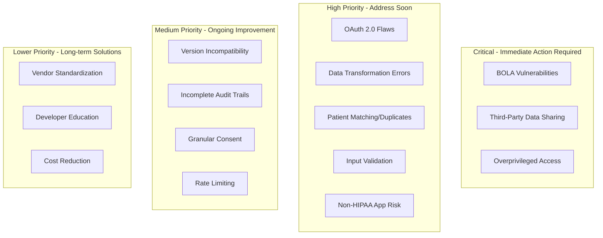
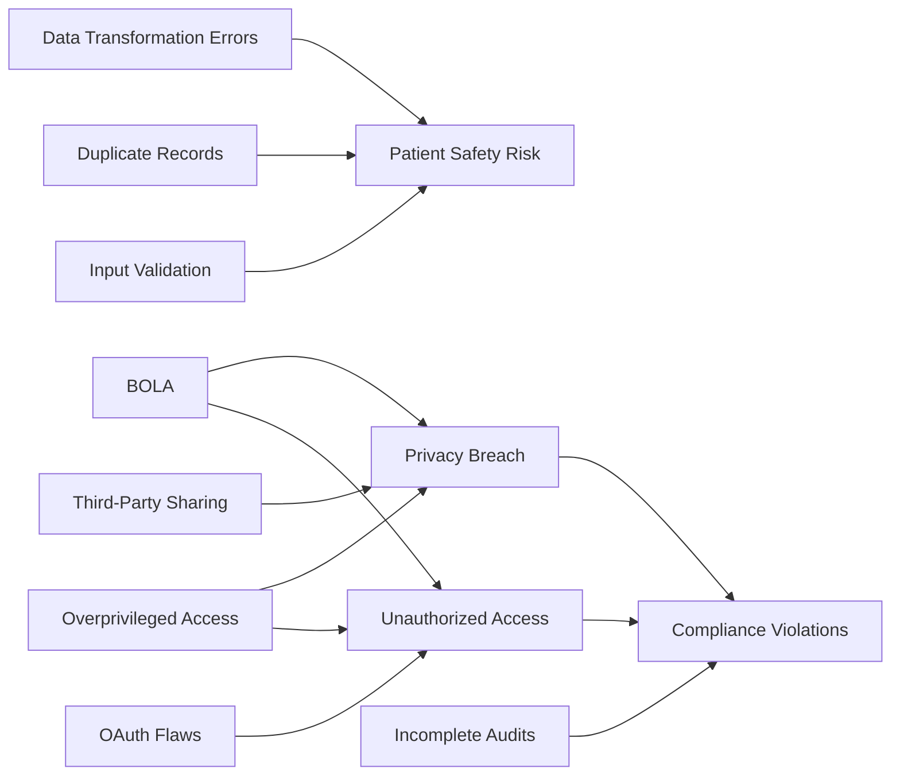

# Problem Analysis and Prioritization

## Executive Summary

This document analyzes the identified problems in SMART on FHIR implementations and prioritizes them based on:
- **Severity**: Potential impact on patient safety, privacy, and system security
- **Frequency**: How often the problem occurs in real-world implementations
- **Feasibility**: How practical it is to implement a solution
- **Impact**: The overall benefit of solving the problem

---

## Problem Categorization

### Category 1: Security Vulnerabilities

| Problem | Severity | Frequency | Research Evidence |
|---------|----------|-----------|-------------------|
| **Broken Object-Level Authorization (BOLA)** | Critical | High | Knight (2021) - Found in majority of tested implementations |
| **OAuth 2.0 Implementation Flaws** | High | High | Hawaii.edu (2022) - CSRF, state parameter issues common |
| **Missing PKCE in Mobile Apps** | High | Medium | Industry reports - Many apps don't implement PKCE |
| **Insufficient API Rate Limiting** | Medium | High | Common attack vector for DoS |
| **Weak Token Management** | High | Medium | Tokens stored insecurely or don't expire |
| **Injection Attacks (SQL, FHIR Query)** | High | Medium | Penetration testing reveals vulnerabilities |
| **Man-in-the-Middle (TLS Issues)** | High | Low | Less common but critical when present |

### Category 2: Privacy Concerns

| Problem | Severity | Frequency | Research Evidence |
|---------|----------|-----------|-------------------|
| **Overprivileged App Access** | High | Very High | Apps request `patient/*.*` instead of specific scopes |
| **Lack of Granular Consent** | High | High | Patients can't control specific data sharing |
| **Third-Party Data Sharing** | Critical | Medium | Apps share PHI with advertisers, no transparency |
| **Patient Consent Management** | Medium | High | Complex workflows confuse users |
| **Cross-App Data Correlation** | Medium | Medium | Multiple apps aggregate data for profiling |
| **Non-HIPAA Covered Apps** | High | Very High | Most consumer health apps not HIPAA covered |

### Category 3: Data Integrity Issues

| Problem | Severity | Frequency | Research Evidence |
|---------|----------|-----------|-------------------|
| **Data Transformation Errors** | High | Very High | Ominext (2024), JMIR studies |
| **Insufficient Input Validation** | High | High | Censinet (2024) - Common in implementations |
| **Version Incompatibility** | Medium | High | FHIR R2/R3/R4 migration issues |
| **Duplicate Patient Records** | High | High | Patient matching failures widespread |
| **Incomplete Audit Trails** | Medium | Very High | Most systems don't log comprehensively |
| **Conflicting Updates** | Medium | Medium | Concurrent modification issues |
| **Incomplete Data Representations** | Medium | High | FHIR can't capture all clinical context |

### Category 4: Implementation & Governance

| Problem | Severity | Frequency | Research Evidence |
|---------|----------|-----------|-------------------|
| **Lack of App Vetting** | High | High | SC World (2024) - No standardized vetting |
| **Inconsistent Vendor Implementation** | Medium | Very High | Each EHR vendor implements differently |
| **Developer Knowledge Gaps** | Medium | High | Don't follow FHIR security best practices |
| **Cost and Complexity** | Low | Very High | Barrier to small healthcare organizations |

---

## Priority Matrix

---

## Top 5 Problems - Deep Dive

### 🎯 #1: Broken Object-Level Authorization (BOLA)

**Description:**  
Users/apps can access patient data beyond their authorization scope, typically accessing other patients' records.

**Why It's Critical:**
- Direct patient safety and privacy risk
- Violates HIPAA
- High frequency in implementations
- Easy to exploit

**Real-World Impact:**
- Single vulnerability can expose millions of patient records
- Legal and financial consequences
- Loss of patient trust

**Gap Analysis:**
| What Exists | What's Missing |
|-------------|----------------|
| OAuth 2.0 scopes defined | Proper scope enforcement at API level |
| FHIR search parameters | Row-level security checks |
| Authorization tokens | Context-aware validation |

**Potential Solutions:**
1. **Middleware Authorization Layer**: Intercept all FHIR requests and validate user context
2. **Fine-Grained Access Control (FGAC)**: Database-level security policies
3. **Automated Security Testing**: Regular penetration testing for BOLA
4. **Scope Validation Framework**: Library to enforce proper scope checking

**Implementation Feasibility:** High - Technical solutions available

---

### 🎯 #2: Third-Party Data Sharing & Non-HIPAA Apps

**Description:**  
Patient data flows to apps not covered by HIPAA, then shared with advertisers/third parties without patient knowledge.

**Why It's Critical:**
- Privacy violation
- Patient consent violated
- No legal recourse for patients
- Difficult to track and control

**Real-World Impact:**
- Patient health data sold to data brokers
- Discrimination based on health conditions
- Loss of patient trust in health apps

**Gap Analysis:**
| What Exists | What's Missing |
|-------------|----------------|
| HIPAA for covered entities | Regulation of consumer health apps |
| Patient can grant access | Transparency in downstream usage |
| BAAs between entities | Post-access data flow monitoring |

**Potential Solutions:**
1. **Data Usage Attestation System**: Apps must declare data usage before access
2. **Blockchain Audit Trail**: Track where data goes after sharing
3. **Patient Data Dashboard**: Show all apps with access and their data usage
4. **App Certification Program**: Verify apps meet privacy standards
5. **Technical Enforcement**: APIs that prevent certain data operations

**Implementation Feasibility:** Medium - Requires policy and technical changes

---

### 🎯 #3: Overprivileged Access / Lack of Granular Consent

**Description:**  
Apps request broad scopes (`patient/*.*`) and patients can't selectively share data types.

**Why It's Critical:**
- Privacy risk - apps get more data than needed
- Patients lose control over their data
- Violates principle of least privilege
- Patients may decline to use beneficial apps

**Real-World Impact:**
- Medication tracking app gets mental health records
- Fitness app accesses sexual health history
- Research app accesses all historical records

**Gap Analysis:**
| What Exists | What's Missing |
|-------------|----------------|
| SMART scopes (patient/Observation.read) | User-friendly consent interface |
| OAuth consent screen | Granular resource-level selection |
| Ability to revoke access | Time-limited access grants |

**Potential Solutions:**
1. **Dynamic Consent UI**: Interactive interface for patients to select specific data
2. **Just-in-Time Access**: Apps request access only when needed
3. **Scope Recommendation Engine**: Suggest minimal scopes for app functionality
4. **Consent Templates**: Pre-defined permission sets for common use cases
5. **Automated Scope Analysis**: Detect when apps over-request

**Implementation Feasibility:** High - UI/UX improvements, policy changes

---

### 🎯 #4: Data Transformation Errors

**Description:**  
Converting data between formats (HL7 v2, CDA, FHIR) introduces errors, loses context, or creates incomplete records.

**Why It's Critical:**
- Patient safety risk - incorrect data leads to wrong treatment
- High frequency - occurs in every data exchange
- Difficult to detect
- Accumulates over time

**Real-World Impact:**
- Allergy information lost in translation
- Medication dosage incorrectly converted
- Diagnostic results misinterpreted
- Clinical context stripped away

**Gap Analysis:**
| What Exists | What's Missing |
|-------------|----------------|
| FHIR mapping specifications | Automated validation of transformations |
| Manual data review processes | Bidirectional transformation testing |
| Error logging | Consistency checking across systems |
| Terminology servers | Semantic preservation verification |

**Potential Solutions:**
1. **Bidirectional Transformation Validator**: Ensure round-trip accuracy
2. **Semantic Loss Detection**: Flag when context is lost
3. **Automated Reconciliation**: Compare pre/post transformation
4. **Reference Implementation**: Standard transformer with extensive testing
5. **Machine Learning**: Detect anomalous transformations

**Implementation Feasibility:** Medium - Complex problem, partial solutions available

---

### 🎯 #5: Patient Matching & Duplicate Records

**Description:**  
Same patient has multiple records across systems, leading to fragmented health history.

**Why It's Critical:**
- Patient safety - incomplete medication lists, missed allergies
- High frequency - occurs in most health systems
- Difficult to resolve retroactively
- Compounds other problems

**Real-World Impact:**
- Provider doesn't see previous diagnosis
- Duplicate medications prescribed
- Lab results filed under wrong patient
- Billing and insurance issues

**Gap Analysis:**
| What Exists | What's Missing |
|-------------|----------------|
| Demographic matching | Unified patient identifier |
| Probabilistic matching algorithms | National patient ID system |
| Manual record merging | Automated de-duplication |
| FHIR Patient resource | Cross-organization matching standard |

**Potential Solutions:**
1. **National Patient Identifier**: Government-issued unique health ID
2. **Blockchain-Based Identity**: Decentralized patient identity
3. **Advanced Matching Algorithms**: Machine learning, biometrics
4. **FHIR Patient Matching API**: Standardized matching service
5. **Master Patient Index (MPI)**: Regional or national MPI service

**Implementation Feasibility:** Low to Medium - Requires policy changes, infrastructure

---

## Problem Interconnections

Many problems are interconnected:

**Insight:** Solving authorization issues (BOLA, OAuth) simultaneously addresses privacy and compliance problems.

---

## Research-Backed Solutions

### Solutions from Academic Literature

1. **Attribute-Based Access Control (ABAC)** - 6B Health (2024)
   - Context-aware permissions
   - Dynamic policy enforcement
   - More granular than RBAC

2. **Zero Trust Architecture** - Multiple sources
   - Never trust, always verify
   - Microsegmentation
   - Continuous authentication

3. **Blockchain for Audit Trails** - Various studies
   - Immutable logging
   - Transparent data sharing
   - Smart contract enforcement

4. **Federated Identity Management** - SMART on FHIR papers
   - Single sign-on across providers
   - Improved patient matching
   - Centralized consent

5. **AI/ML for Anomaly Detection** - Emerging research
   - Detect unusual access patterns
   - Identify data quality issues
   - Automated security monitoring

---

## Recommended Implementation Priorities

### Phase 1: Immediate (0-6 months)
1. **Fix BOLA vulnerabilities** - Security-critical
2. **Implement proper scope validation** - Privacy-critical
3. **Add comprehensive audit logging** - Compliance-critical

### Phase 2: Short-term (6-12 months)
4. **Improve consent UX with granular controls** - User experience
5. **Strengthen OAuth 2.0 implementation** - Security enhancement
6. **Add input validation framework** - Data integrity

### Phase 3: Medium-term (1-2 years)
7. **Build app certification program** - Ecosystem improvement
8. **Develop patient data dashboard** - Transparency
9. **Implement advanced patient matching** - Data quality

### Phase 4: Long-term (2+ years)
10. **Contribute to FHIR standard improvements** - Industry impact
11. **Build reference implementations** - Enable others
12. **Research blockchain/AI solutions** - Innovation

---

## Research Opportunities

### Unexplored Areas for Capstone Projects:

1. **Automated BOLA Detection Tool**
   - Tool to scan FHIR implementations for BOLA vulnerabilities
   - Integrate with CI/CD pipelines
   - **Gap:** No open-source tools exist

2. **Patient-Friendly Consent Interface**
   - Mobile/web UI for granular consent management
   - Visual representation of data sharing
   - **Gap:** Current interfaces are technical and confusing

3. **FHIR Data Transformation Validator**
   - Automated testing framework for transformations
   - Semantic loss detection
   - **Gap:** Manual testing only

4. **SMART App Security Scorecard**
   - Automated analysis of app permissions
   - Privacy and security grading
   - **Gap:** No consumer-facing tool exists

5. **Real-Time Audit Anomaly Detection**
   - ML-based detection of suspicious access patterns
   - Alert system for security teams
   - **Gap:** Most systems only log, don't analyze

6. **Blockchain-Based Consent Management**
   - Immutable consent records
   - Patient-controlled access
   - **Gap:** Proof-of-concept only, no production system

---

## Next Steps

Based on this analysis, the next document provides a **Solution Framework** with detailed technical architectures for addressing priority problems.

See **[5_Solution_Framework.md](./5_Solution_Framework.md)** for implementation strategies.
