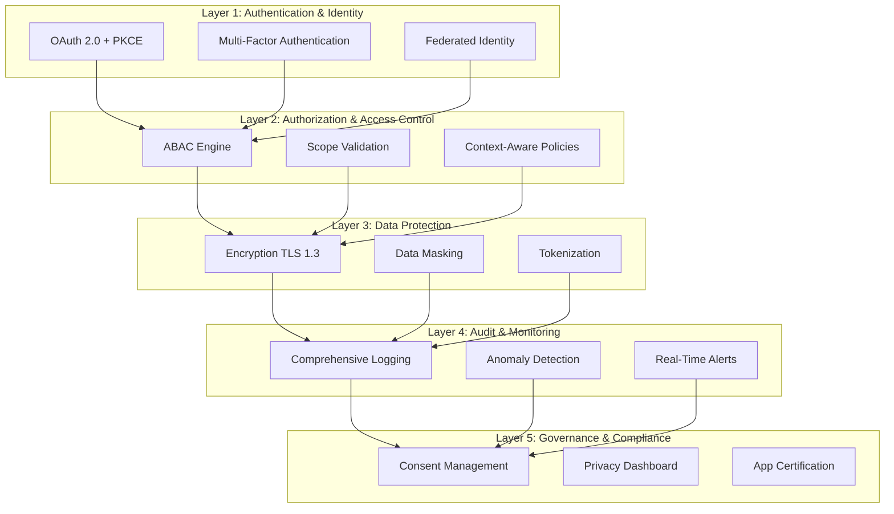
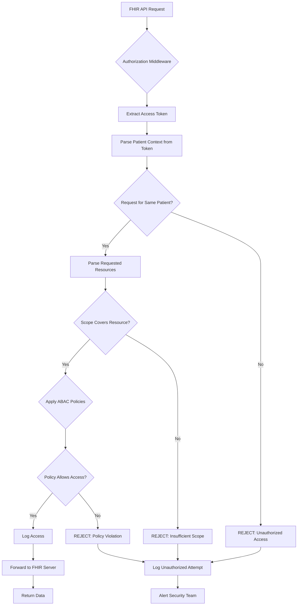
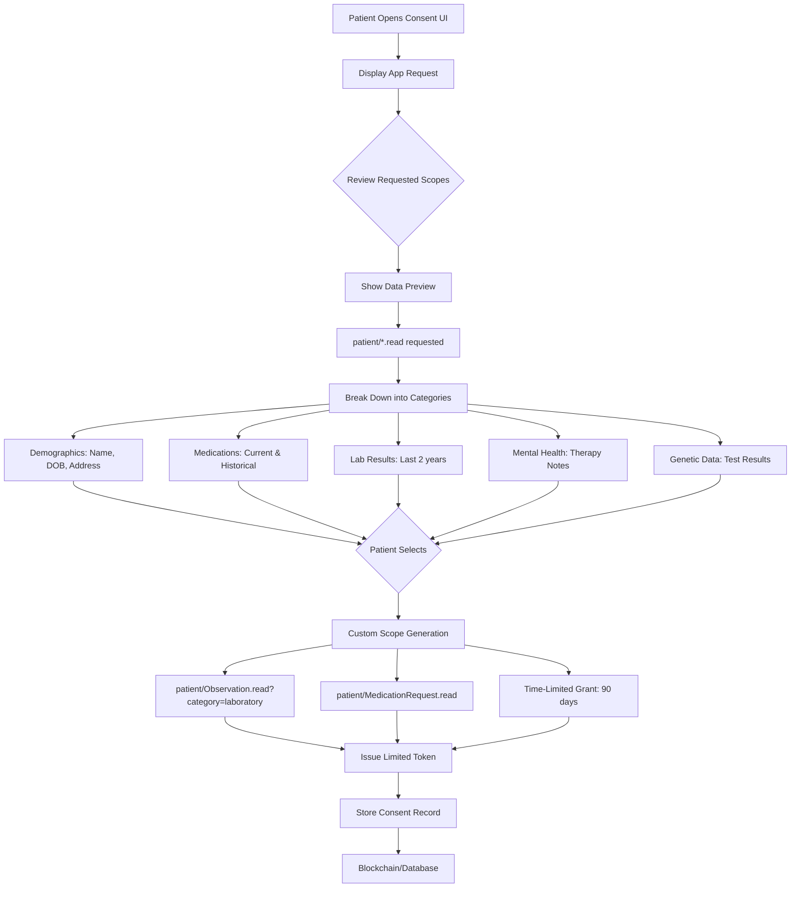
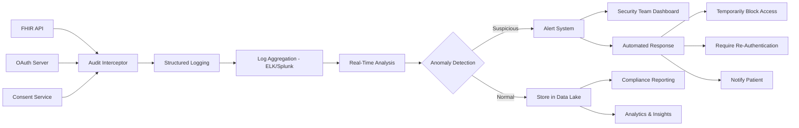

# Solution Framework for SMART on FHIR Security Issues

## Table of Contents
1. [Solution Architecture Overview](#solution-architecture-overview)
2. [Priority Solution #1: BOLA Prevention Framework](#priority-solution-1-bola-prevention-framework)
3. [Priority Solution #2: Granular Consent Management System](#priority-solution-2-granular-consent-management-system)
4. [Priority Solution #3: Comprehensive Audit & Monitoring](#priority-solution-3-comprehensive-audit--monitoring)
5. [Supporting Solutions](#supporting-solutions)
6. [Implementation Roadmap](#implementation-roadmap)
7. [Research References](#research-references)

---

## Solution Architecture Overview

### Layered Security Approach



---

## Priority Solution #1: BOLA Prevention Framework

### Problem Recap
Broken Object-Level Authorization allows users/apps to access patient data outside their authorization scope.

### Solution Architecture



### Technical Implementation

#### Component 1: Authorization Middleware

**Technology Stack:**
- Language: Python / Node.js / Java
- Framework: Express.js, Flask, Spring Boot
- Libraries: PyJWT, jsonwebtoken, jose

**Pseudocode:**

```python
class FHIRAuthorizationMiddleware:
    def __init__(self, policy_engine, audit_logger):
        self.policy_engine = policy_engine
        self.audit_logger = audit_logger
    
    def authorize_request(self, request):
        # Extract and validate token
        token = self.extract_token(request)
        if not self.validate_token(token):
            return self.deny_access("Invalid token")
        
        # Parse token claims
        patient_id = token.claims.get('patient')
        scopes = token.claims.get('scope', '').split()
        user_id = token.claims.get('sub')
        
        # Extract requested resource
        resource_type = self.get_resource_type(request.path)
        requested_patient_id = self.get_patient_from_request(request)
        
        # BOLA Check: Ensure accessing own patient data
        if patient_id != requested_patient_id:
            self.audit_logger.log_unauthorized_access(
                user_id, requested_patient_id, resource_type
            )
            return self.deny_access("BOLA violation detected")
        
        # Scope validation
        required_scope = f"patient/{resource_type}.read"
        if required_scope not in scopes and "patient/*.read" not in scopes:
            return self.deny_access("Insufficient scope")
        
        # ABAC policy evaluation
        context = {
            'user': user_id,
            'patient': patient_id,
            'resource_type': resource_type,
            'action': 'read',
            'time': datetime.now(),
            'location': request.ip
        }
        
        if not self.policy_engine.evaluate(context):
            return self.deny_access("Policy violation")
        
        # Log successful access
        self.audit_logger.log_access(user_id, patient_id, resource_type)
        
        return self.allow_access(request)
```

#### Component 2: Attribute-Based Access Control (ABAC) Engine

**Policy Language:** XACML or custom DSL

**Example Policy:**

```json
{
  "policy_id": "patient_data_access",
  "description": "Control patient data access based on context",
  "rules": [
    {
      "effect": "Permit",
      "target": {
        "resource": "Patient",
        "action": "read"
      },
      "condition": {
        "and": [
          {"subject.id": {"equals": "resource.patient_id"}},
          {"subject.role": {"in": ["patient", "provider"]}},
          {"time.hour": {"between": [6, 22]}}
        ]
      }
    },
    {
      "effect": "Deny",
      "target": {
        "resource": "Observation",
        "action": "read"
      },
      "condition": {
        "and": [
          {"resource.category": {"equals": "mental-health"}},
          {"subject.role": {"equals": "patient"}},
          {"subject.explicit_consent": {"equals": false}}
        ]
      }
    }
  ]
}
```

#### Component 3: Automated Testing for BOLA

**Tool:** Custom security scanner

**Features:**
- Automated API fuzzing
- Token manipulation tests
- Patient ID substitution tests
- Continuous security testing

**Test Cases:**

```python
class BOLASecurityTests:
    def test_patient_id_substitution(self):
        """Test if user can access another patient's data"""
        # Get token for Patient A
        token_patient_a = self.get_token(patient_id="123")
        
        # Try to access Patient B's data with Patient A's token
        response = self.api_client.get(
            "/Patient/456",
            headers={"Authorization": f"Bearer {token_patient_a}"}
        )
        
        # Should be denied
        assert response.status_code == 403
        assert "BOLA" in response.json()['error']
    
    def test_wildcard_patient_query(self):
        """Test if user can query all patients"""
        token = self.get_token(patient_id="123")
        
        response = self.api_client.get(
            "/Patient",  # Search all patients
            headers={"Authorization": f"Bearer {token}"}
        )
        
        # Should only return authorized patient
        data = response.json()
        assert len(data['entry']) == 1
        assert data['entry'][0]['resource']['id'] == "123"
```

### Implementation Checklist

- [ ] Develop authorization middleware
- [ ] Implement ABAC policy engine
- [ ] Create policy management UI for administrators
- [ ] Write comprehensive test suite
- [ ] Integrate with existing FHIR server
- [ ] Deploy in production with monitoring
- [ ] Document implementation for other developers

**Estimated Effort:** 3-4 months (1-2 developers)

**Research Reference:** 6B Health (2024) - FHIR API Security Framework with ABAC

---

## Priority Solution #2: Granular Consent Management System

### Problem Recap
Patients can't selectively share data; apps request overly broad permissions.

### Solution Architecture



### Technical Implementation

#### Component 1: Interactive Consent UI

**Technology:**
- Frontend: React / Vue.js
- Backend: Node.js / Python
- State Management: Redux / Vuex

**Mockup Components:**

```javascript
// React Component for Consent Selection
import React, { useState } from 'react';

function ConsentManager({ appRequest, onApprove, onDeny }) {
  const [selectedScopes, setSelectedScopes] = useState([]);
  const [timeLimit, setTimeLimit] = useState(90); // days
  
  const scopeCategories = {
    demographics: {
      label: "Basic Information",
      data: ["Name", "Date of Birth", "Address", "Phone"],
      scope: "patient/Patient.read",
      preview: patient.name
    },
    medications: {
      label: "Medications",
      data: ["Current Medications", "Medication History"],
      scope: "patient/MedicationRequest.read",
      preview: `${medicationCount} medications`
    },
    labResults: {
      label: "Laboratory Results",
      data: ["Blood Tests", "Urine Tests", "Imaging"],
      scope: "patient/Observation.read?category=laboratory",
      preview: `${labCount} recent results`
    },
    mentalHealth: {
      label: "Mental Health Data",
      data: ["Therapy Notes", "Psychiatric Diagnoses"],
      scope: "patient/Observation.read?category=mental-health",
      preview: "Sensitive - Click to view count",
      sensitive: true
    }
  };
  
  const toggleScope = (category) => {
    setSelectedScopes(prev => 
      prev.includes(category)
        ? prev.filter(s => s !== category)
        : [...prev, category]
    );
  };
  
  const handleApprove = () => {
    const grantedScopes = selectedScopes.map(
      cat => scopeCategories[cat].scope
    );
    
    onApprove({
      scopes: grantedScopes,
      expiresIn: timeLimit * 24 * 60 * 60, // Convert days to seconds
      app: appRequest.clientId,
      timestamp: new Date().toISOString()
    });
  };
  
  return (
    <div className="consent-manager">
      <h2>{appRequest.appName} wants to access your health data</h2>
      
      <div className="scope-selection">
        {Object.entries(scopeCategories).map(([key, category]) => (
          <ScopeCard
            key={key}
            category={category}
            selected={selectedScopes.includes(key)}
            onToggle={() => toggleScope(key)}
          />
        ))}
      </div>
      
      <div className="time-limit">
        <label>Grant access for:</label>
        <select value={timeLimit} onChange={(e) => setTimeLimit(e.target.value)}>
          <option value={30}>30 days</option>
          <option value={90}>90 days</option>
          <option value={180}>6 months</option>
          <option value={365}>1 year</option>
        </select>
      </div>
      
      <div className="actions">
        <button onClick={handleApprove}>Approve Selected</button>
        <button onClick={onDeny}>Deny All</button>
      </div>
    </div>
  );
}
```

#### Component 2: Consent Storage & Management

**Database Schema:**

```sql
CREATE TABLE consent_grants (
    consent_id UUID PRIMARY KEY,
    patient_id VARCHAR(255) NOT NULL,
    app_client_id VARCHAR(255) NOT NULL,
    granted_scopes TEXT[] NOT NULL,
    granted_at TIMESTAMP NOT NULL,
    expires_at TIMESTAMP NOT NULL,
    revoked BOOLEAN DEFAULT FALSE,
    revoked_at TIMESTAMP,
    created_by VARCHAR(255),
    
    INDEX idx_patient (patient_id),
    INDEX idx_app (app_client_id),
    INDEX idx_expires (expires_at)
);

CREATE TABLE consent_audit_log (
    log_id UUID PRIMARY KEY,
    consent_id UUID REFERENCES consent_grants(consent_id),
    action VARCHAR(50) NOT NULL, -- 'granted', 'revoked', 'accessed'
    timestamp TIMESTAMP NOT NULL,
    details JSONB
);
```

**Blockchain Alternative (for immutability):**

```solidity
// Ethereum Smart Contract for Consent
pragma solidity ^0.8.0;

contract ConsentManagement {
    struct Consent {
        address patient;
        string appId;
        string[] scopes;
        uint256 grantedAt;
        uint256 expiresAt;
        bool revoked;
    }
    
    mapping(bytes32 => Consent) public consents;
    mapping(address => bytes32[]) public patientConsents;
    
    event ConsentGranted(bytes32 consentId, address patient, string appId);
    event ConsentRevoked(bytes32 consentId, address patient);
    
    function grantConsent(
        string memory appId,
        string[] memory scopes,
        uint256 duration
    ) public returns (bytes32) {
        bytes32 consentId = keccak256(
            abi.encodePacked(msg.sender, appId, block.timestamp)
        );
        
        consents[consentId] = Consent({
            patient: msg.sender,
            appId: appId,
            scopes: scopes,
            grantedAt: block.timestamp,
            expiresAt: block.timestamp + duration,
            revoked: false
        });
        
        patientConsents[msg.sender].push(consentId);
        
        emit ConsentGranted(consentId, msg.sender, appId);
        return consentId;
    }
    
    function revokeConsent(bytes32 consentId) public {
        require(consents[consentId].patient == msg.sender, "Not your consent");
        consents[consentId].revoked = true;
        
        emit ConsentRevoked(consentId, msg.sender);
    }
    
    function isConsentValid(bytes32 consentId) public view returns (bool) {
        Consent memory consent = consents[consentId];
        return !consent.revoked && block.timestamp < consent.expiresAt;
    }
}
```

#### Component 3: Patient Privacy Dashboard

**Features:**
- View all active app connections
- See what data each app has accessed
- Revoke access to specific apps
- View audit trail of data access
- Download consent history

**API Endpoints:**

```javascript
// Express.js Routes
router.get('/api/patient/:id/consents', async (req, res) => {
  const consents = await ConsentService.getActiveConsents(req.params.id);
  res.json(consents);
});

router.get('/api/patient/:id/access-log', async (req, res) => {
  const logs = await AuditService.getAccessLog(req.params.id, {
    startDate: req.query.start,
    endDate: req.query.end
  });
  res.json(logs);
});

router.post('/api/consent/:id/revoke', async (req, res) => {
  await ConsentService.revokeConsent(req.params.id);
  res.json({ success: true });
});
```

### Implementation Checklist

- [ ] Design and implement consent UI/UX
- [ ] Develop consent storage backend
- [ ] Build patient privacy dashboard
- [ ] Integrate with OAuth flow
- [ ] Create API for consent validation
- [ ] Write user documentation
- [ ] Conduct usability testing with patients

**Estimated Effort:** 4-6 months (2-3 developers)

**Research Reference:** Descope (2024), Kepler.team (2024) - SMART on FHIR Consent Management

---

## Priority Solution #3: Comprehensive Audit & Monitoring

### Problem Recap
Most systems don't log comprehensively; no real-time anomaly detection.

### Solution Architecture



### Technical Implementation

#### Component 1: Comprehensive Logging

**Log Structure (JSON):**

```json
{
  "timestamp": "2024-02-06T09:30:00.000Z",
  "event_type": "data_access",
  "actor": {
    "id": "dr_smith_123",
    "type": "provider",
    "role": "physician",
    "organization": "Memorial Hospital"
  },
  "patient": {
    "id": "patient_456",
    "age_category": "adult"
  },
  "resource": {
    "type": "MedicationRequest",
    "id": "med_789",
    "category": "antibiotics"
  },
  "action": "read",
  "context": {
    "app_id": "epic_emr",
    "session_id": "sess_abc123",
    "ip_address": "10.20.30.40",
    "user_agent": "Mozilla/5.0...",
    "purpose_of_use": "treatment"
  },
  "authorization": {
    "method": "oauth2",
    "scopes": ["patient/MedicationRequest.read"],
    "consent_id": "consent_xyz"
  },
  "result": {
    "status": "success",
    "records_returned": 5,
    "response_time_ms": 45
  }
}
```

**Logging Implementation:**

```python
class ComprehensiveAuditLogger:
    def __init__(self, log_backend):
        self.backend = log_backend  # Elasticsearch, Splunk, etc.
    
    def log_access(self, event):
        log_entry = {
            "timestamp": datetime.utcnow().isoformat(),
            "event_type": event.type,
            "actor": self._serialize_actor(event.actor),
            "patient": self._serialize_patient(event.patient),
            "resource": self._serialize_resource(event.resource),
            "action": event.action,
            "context": self._get_context(event.request),
            "authorization": self._get_auth_details(event.token),
            "result": self._get_result(event.response)
        }
        
        # Add to queue for async processing
        self.backend.index(log_entry)
        
        # If sensitive access, also log to immutable store
        if self._is_sensitive(event.resource):
            self.blockchain_logger.append(log_entry)
    
    def _is_sensitive(self, resource):
        sensitive_categories = [
            'mental-health',
            'sexual-health',
            'genetic',
            'substance-abuse'
        ]
        return resource.category in sensitive_categories
```

#### Component 2: Anomaly Detection

**Machine Learning Approach:**

```python
from sklearn.ensemble import IsolationForest
import numpy as np

class AnomalyDetector:
    def __init__(self):
        self.model = IsolationForest(contamination=0.01)
        self.feature_extractor = FeatureExtractor()
    
    def train(self, historical_logs):
        """Train on normal access patterns"""
        features = self.feature_extractor.extract(historical_logs)
        self.model.fit(features)
    
    def detect(self, access_event):
        """Detect if access event is anomalous"""
        features = self.feature_extractor.extract([access_event])
        prediction = self.model.predict(features)
        
        if prediction == -1:  # Anomaly detected
            return self._assess_risk(access_event, features)
        
        return {'anomaly': False}
    
    def _assess_risk(self, event, features):
        risk_score = self.model.score_samples(features)[0]
        
        anomalies = []
        
        # Unusual time
        if event.hour < 6 or event.hour > 22:
            anomalies.append("access_outside_normal_hours")
        
        # Unusual volume
        if event.records_returned > self._get_normal_volume(event.actor):
            anomalies.append("unusually_large_data_pull")
        
        # First time accessing this patient
        if not self._has_previous_access(event.actor, event.patient):
            anomalies.append("first_time_patient_access")
        
        # Rapid sequential access
        if self._detect_rapid_fire(event.actor):
            anomalies.append("rapid_sequential_requests")
        
        return {
            'anomaly': True,
            'risk_score': abs(risk_score),
            'reasons': anomalies,
            'recommended_action': self._recommend_action(anomalies)
        }
    
    def _recommend_action(self, anomalies):
        if len(anomalies) >= 3:
            return "block_and_alert"
        elif "unusually_large_data_pull" in anomalies:
            return "require_justification"
        else:
            return "monitor_closely"
```

**Rule-Based Detection:**

```python
class RuleBasedAnomalyDetector:
    def __init__(self):
        self.rules = [
            # Geographic impossibility
            {
                'name': 'geographic_impossibility',
                'check': lambda event: self._check_location_jump(event),
                'severity': 'high'
            },
            # Excessive bulk access
            {
                'name': 'bulk_access',
                'check': lambda event: event.records_returned > 100,
                'severity': 'high'
            },
            # Access with expired consent
            {
                'name': 'expired_consent',
                'check': lambda event: self._is_consent_expired(event),
                'severity': 'critical'
            },
            # Break the glass access
            {
                'name': 'emergency_access',
                'check': lambda event: event.purpose == 'emergency',
                'severity': 'medium',
                'action': 'notify_patient_after_fact'
            }
        ]
    
    def evaluate(self, event):
        violations = []
        
        for rule in self.rules:
            if rule['check'](event):
                violations.append({
                    'rule': rule['name'],
                    'severity': rule['severity'],
                    'action': rule.get('action', 'alert')
                })
        
        return violations
```

#### Component 3: Real-Time Alerting

**Alert Routing:**

```python
class AlertManager:
    def __init__(self, notification_service):
        self.notifier = notification_service
    
    def handle_anomaly(self, anomaly, event):
        severity = anomaly['risk_score']
        
        if severity > 0.8:  # Critical
            self._escalate_critical(anomaly, event)
        elif severity > 0.5:  # High
            self._alert_security_team(anomaly, event)
        else:  # Medium
            self._flag_for_review(anomaly, event)
    
    def _escalate_critical(self, anomaly, event):
        # Immediately block access
        self.access_control.revoke_token(event.token)
        
        # Alert security team via multiple channels
        self.notifier.send_email(
            to='security@hospital.com',
            subject='CRITICAL: Potential data breach detected',
            body=self._format_alert(anomaly, event)
        )
        
        self.notifier.send_sms(
            to='+1234567890',
            message=f"Critical security alert: {anomaly['reasons']}"
        )
        
        # Notify patient
        self.notifier.send_patient_alert(
            patient_id=event.patient_id,
            message="Unusual access to your health records detected. Access has been blocked."
        )
        
        # Create incident ticket
        self.incident_management.create_ticket({
            'priority': 'P1',
            'summary': 'Anomalous FHIR access detected',
            'details': anomaly
        })
```

### Implementation Checklist

- [ ] Set up centralized logging infrastructure (ELK/Splunk)
- [ ] Implement comprehensive audit logging
- [ ] Develop anomaly detection models
- [ ] Build real-time alerting system
- [ ] Create security dashboard for monitoring
- [ ] Define incident response procedures
- [ ] Train security team on new tools

**Estimated Effort:** 3-4 months (2 developers + 1 ML engineer)

**Research References:** Various industry best practices for Security Information and Event Management (SIEM)

---

## Supporting Solutions

### 4. OAuth 2.0 Hardening

**Key Improvements:**
- Mandatory PKCE for all clients
- State parameter validation
- Strict redirect URI matching
- Short-lived access tokens (1 hour max)
- Refresh token rotation

### 5. Input Validation Framework

**Approach:**
- FHIR profile validation
- Schema validation at API gateway
- Business rule validation
- SQL/NoSQL injection prevention

### 6. Data Transformation Validator

**Features:**
- Bidirectional transformation testing
- Semantic consistency checks
- Automated regression testing
- Transformation audit trail

### 7. Patient Matching Service

**Techniques:**
- Probabilistic matching algorithms
- Machine learning for disambiguation
- Blockchain-based patient identifiers
- Integration with national patient ID systems

---

## Implementation Roadmap

### Phase 1: Foundation (Months 1-3)
- Set up development environment
- Deploy logging infrastructure
- Implement basic authorization middleware
- Create initial security test suite

### Phase 2: Core Security (Months 4-6)
- Full BOLA prevention framework
- OAuth 2.0 hardening
- Comprehensive audit logging
- Anomaly detection MVP

### Phase 3: Patient Empowerment (Months 7-9)
- Granular consent UI
- Patient privacy dashboard
- Consent management API
- User testing and refinement

### Phase 4: Advanced Features (Months 10-12)
- Machine learning anomaly detection
- Blockchain consent ledger (optional)
- App certification program
- Advanced reporting and analytics

### Phase 5: Production & Scale (Months 13-18)
- Production deployment
- Performance optimization
- Security audits and penetration testing
- Documentation and training

---

## Technology Stack Recommendations

### Backend
- **Language:** Python 3.11+ or Node.js 18+
- **Framework:** FastAPI / Express.js
- **Database:** PostgreSQL 14+ for transactional data
- **Cache:** Redis for session/token storage
- **Message Queue:** RabbitMQ / Apache Kafka for async processing

### Frontend
- **Framework:** React 18+ / Vue 3
- **State Management:** Redux Toolkit / Pinia
- **UI Library:** Material-UI / Ant Design
- **Build Tool:** Vite

### Infrastructure
- **Container:** Docker
- **Orchestration:** Kubernetes
- **Service Mesh:** Istio (for advanced security policies)
- **Logging:** ELK Stack (Elasticsearch, Logstash, Kibana)
- **Monitoring:** Prometheus + Grafana
- **Secrets Management:** HashiCorp Vault

### Security Tools
- **SAST:** SonarQube, Snyk
- **DAST:** OWASP ZAP
- **Penetration Testing:** Burp Suite
- **Dependency Scanning:** Dependabot, npm audit

---

## Research References

### Implementation Guides

1. **6B Health (2024).** "Comprehensive FHIR API Security Framework."
   - ABAC implementation patterns
   - [Link](https://6b.health/)

2. **HL7 FHIR Security Implementation Guide (2024).**
   - Official security recommendations
   - [Link](https://www.hl7.org/fhir/security.html)

3. **SMART Health IT Developer Documentation.**
   - OAuth implementation details
   - [Link](https://smarthealthit.org/)

### Academic Research

4. **Leroux, H., et al. (2022).** "Security Best Practices for FHIR Server Implementations."
   - Penetration testing methodology
   - Recommended controls

5. **Mandel, J. C., et al. (2016).** "SMART on FHIR: Design Principles and Implementation."
   - Authorization architecture

### Industry Standards

6. **NIST Cybersecurity Framework.**
   - Security control baselines

7. **OWASP API Security Top 10.**
   - Common API vulnerabilities

8. **CIS Benchmarks for Healthcare.**
   - Security configuration standards

---

## Success Metrics

### Security Metrics
- **BOLA vulnerability rate:** 0% in production
- **Failed authorization attempts:** < 0.1% of total requests
- **Mean time to detect (MTTD):** < 5 minutes
- **Mean time to respond (MTTR):** < 30 minutes

### Privacy Metrics
- **Consent granularity:** Average 3.5 specific scopes per grant (vs. wildcard)
- **Patient dashboard adoption:** > 60% of patients view their access log
- **Consent revocations:** < 5% within 30 days (indicates good initial UX)

### Compliance Metrics
- **Audit log completeness:** 100% of access events logged
- **Audit log retention:** 6 years (HIPAA requirement)
- **Compliance violations:** 0 reportable incidents

### Performance Metrics
- **Authorization latency:** < 50ms for 95th percentile
- **API response time impact:** < 10% increase
- **System uptime:** 99.9%

---

## Conclusion

This solution framework provides a comprehensive, research-backed approach to addressing the most critical security, privacy, and data integrity issues in SMART on FHIR implementations.

**Key Takeaways:**
1. **Layered security** is essential - no single solution solves all problems
2. **Patient empowerment** through transparency and control
3. **Proactive detection** via comprehensive logging and ML
4. **Standards-based** implementation ensures interoperability
5. **Continuous improvement** through security testing and monitoring

**Next Steps:**
- Select specific problem(s) to address for your Capstone project
- Review implementation checklist for chosen solution
- Set up development environment
- Begin Phase 1 implementation

For detailed academic references and further reading, see the reference sections in each document.
